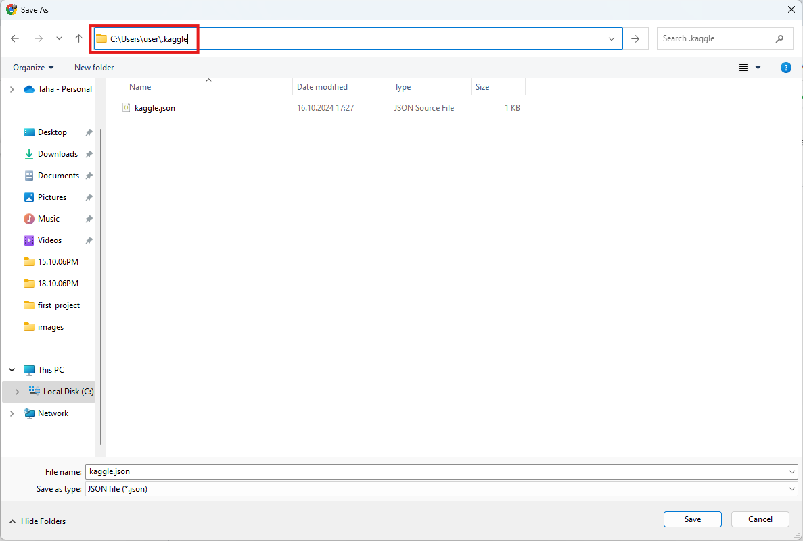

# London Bike Sharing Data Analyst Project

[Dashboard link](https://public.tableau.com/views/Book2_17291882283200/Dashboard1?:language=en-US&:sid=&:redirect=auth&:display_count=n&:origin=viz_share_link)
## Table of Contents
[1. Project Overview](#project-overview)

[2. Dataset](#dataset)

[3. Installation](#installation)

[4. Usage](#usage)
   - Data Gathering
   - Data Exploration and Assessment
   - Data Manipulation
   - Exporting Cleaned Data  
  
[5. Visualizations](#visualizations)
   - Total Number of Bike Rides
   - Moving Average Chart
   - Temperature vs. Wind Speed Heat Map
   - Bike Rides by Weather
   - Bike Rides by Hour   
 
[6. Dashboard](#dashboard)

[7. Conclusion](#conclusion)

[8. Resources](#resources)

[9. Contact](#contact)

### Project Overview
As a data analyst, the ability to create dynamic, user-friendly, and visually appealing dashboards is crucial. This end-to-end portfolio project demonstrates how to gather data programmatically, assess and explore it using Python's Pandas library, manipulate the data, and finally create impactful visualizations in Tableau. By the end of this project, you'll have a comprehensive dashboard that showcases your data analysis skills.

### Dataset
This project utilizes the [London Bike Sharing dataset](https://www.kaggle.com/datasets/hmavrodiev/london-bike-sharing-dataset) from Kaggle. The dataset contains information about bike sharing in London, including timestamps, bike ride counts, temperature, humidity, wind speed, weather conditions, holidays, weekends, and seasons.

**Note:** Ensure you have a Kaggle account and have set up the [Kaggle API](https://www.kaggle.com/docs/api)  credentials before proceeding.




**Note:** If you do not yet have a .kaggle extension file in the location I specified, keep moving and I will specify it again.

### Installation
**Prerequisites**
- Python 3.x
- Jupyter Notebook or JupyterLab
- Git
- Tableau Public Desktop (for visualizations)

**Clone the Repository**
```bash
git clone https://github.com/your-username/london-bike-sharing-data-analyst.git
cd london-bike-sharing-data-analyst
```
**Intall Required Libraries**
Ensure you have the necessary Python libraries installed. You can install them using **pip**:
```bash
# Uncomment the following lines to install necessary libraries
!pip install pandas
!pip install zipfile36
!pip install kaggle
```

Alternatively, you can install all dependencies at once:
```bash
pip install -r requirements.txt
```

### Usage
**Data Gathering**
The first step involves programmatically downloading the dataset from Kaggle using the Kaggle API.
```python
# Uncomment the pip install code below if you haven't installed these libraries yet
!pip install pandas
!pip install zipfile36
!pip install kaggle
```
```python
# Import necessary libraries
import pandas as pd
import zipfile36 as zipfile
import kaggle
```
```python
# Authenticate with Kaggle API
from kaggle.api.kaggle_api_extended import KaggleApi

api = KaggleApi()
api.authenticate()
print("Authentication Successful!")
```
```python
# Download dataset from Kaggle using the Kaggle API
!kaggle datasets download -d hmavrodiev/london-bike-sharing-dataset
# The exclamation mark (!) allows running the command as a shell command
```
**Data Exploration and Assessment**
After downloading, extract the dataset and load it into a Pandas DataFrame for exploration.
```py
# Extract the downloaded zip file
zipfile_name = 'london-bike-sharing-dataset.zip'
with zipfile.ZipFile(zipfile_name, 'r') as file:
    file.extractall()
```
```py
# Read the CSV file into a pandas DataFrame
bikes = pd.read_csv("london_merged.csv")
```
```py
# Explore the data
bikes.info()
```
```py
# Display the shape of the DataFrame
print(bikes.shape)
```
```py
# Display the first few rows of the dataset
bikes.head()
```
```py
# Count the unique values in the weather_code column
bikes.weather_code.value_counts()
```
```py
# Count the unique values in the season column
bikes.season.value_counts()
```

**Data Manipulation**
Clean and prepare the data for analysis by renaming columns, converting data types and mapping categorical codes to descriptive labels.
```py
# Specify the column names for better readability
new_cols_dict = {
    'timestamp': 'time',
    'cnt': 'count',
    't1': 'temp_real_C',
    't2': 'temp_feels_like_C',
    'hum': 'humidity_percent',
    'wind_speed': 'wind_speed_kph',
    'weather_code': 'weather',
    'is_holiday': 'is_holiday',
    'is_weekend': 'is_weekend',
    'season': 'season'
}

# Rename the columns
bikes.rename(new_cols_dict, axis=1, inplace=True)
```
```py
# Convert humidity percentages to decimals (0 to 1)
bikes.humidity_percent = bikes.humidity_percent / 100
```
```py
# Create dictionaries to map numerical codes to descriptive labels
season_dict = {
    '0.0': 'spring',
    '1.0': 'summer',
    '2.0': 'autumn',
    '3.0': 'winter'
}

weather_dict = {
    '1.0': 'Clear',
    '2.0': 'Scattered clouds',
    '3.0': 'Broken clouds',
    '4.0': 'Cloudy',
    '7.0': 'Rain',
    '10.0': 'Rain with thunderstorm',
    '26.0': 'Snowfall'
}

# Change the 'season' column data type to string and map the values
bikes.season = bikes.season.astype('str')
bikes.season = bikes.season.map(season_dict)

# Change the 'weather' column data type to string and map the values
bikes.weather = bikes.weather.astype('str')
bikes.weather = bikes.weather.map(weather_dict)
```

### Visualizations
All visualizations are created using Tableau and are included in the visualizations folder. Below is a brief overview of each visualization with placeholders for images and GIFs. If you learn "how to do visualize on Tableau?", please watch the [video](https://youtu.be/nl9eZl1IOKI?si=NB3XEKIMZwNCOTHy&t=415).

1. Total Number of Bike Rides
This visualization displays the total number of bike rides over the selected time period.


2. Moving Average Chart
The moving average chart showcases the trend of bike rides over time with dynamic parameters for different time windows (day, week, month).


3. Temperature vs. Wind Speed Heat Map
This heat map visualizes the relationship between temperature and wind speed, providing insights into how weather conditions affect bike usage.


4. Bike Rides by Weather
This bar chart breaks down the number of bike rides based on different weather conditions.


5. Bike Rides by Hour
Understanding bike usage patterns throughout the day helps in planning and resource allocation.


### Dashboard
The final dashboard integrates all the visualizations, allowing for interactive data exploration. Users can adjust parameters such as the moving average period and filter the timeline to see how bike rides fluctuate under different conditions.


**Features**
- Dynamic Parameters: Users can select the moving average period (day, week, month) and duration to see how trends change.
- Interactive Filters: Filter the timeline to focus on specific date ranges.
- Tooltips with Additional Charts: Hovering over visualizations displays additional insights like bike rides split by weather and hour.

### Conclusion
This project demonstrates a complete data analysis workflow, from data gathering and cleaning to creating insightful visualizations and assembling them into a dynamic dashboard. By leveraging Python for data manipulation and Tableau for visualization, this project showcases essential skills for a data analyst role.

### Resources
- [Video Guide](https://youtu.be/nl9eZl1IOKI?si=ik3060A_yeGgMCTg)
- [London Bike Rider DataSet](https://www.kaggle.com/datasets/hmavrodiev/london-bike-sharing-dataset)
- [Kaggle API Documentation](https://www.kaggle.com/docs/api)
- Pandas Documentation
- Tableau Official Documentation

### Contact
For any questions or feedback, feel free to reach out:

Email: tahaasann@gmail.com
LinkedIn: [Taha S. ASAN](https://www.linkedin.com/in/tahaasann)
GitHub: [tahaasann](https://www.github.com/tahaasann)